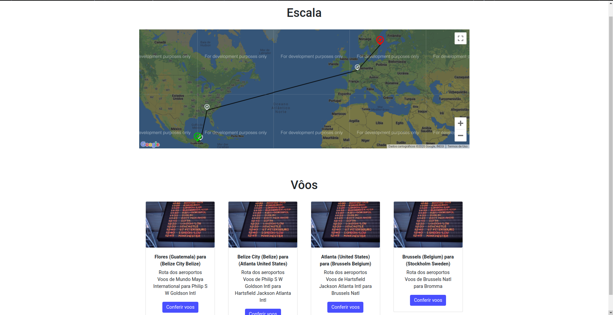
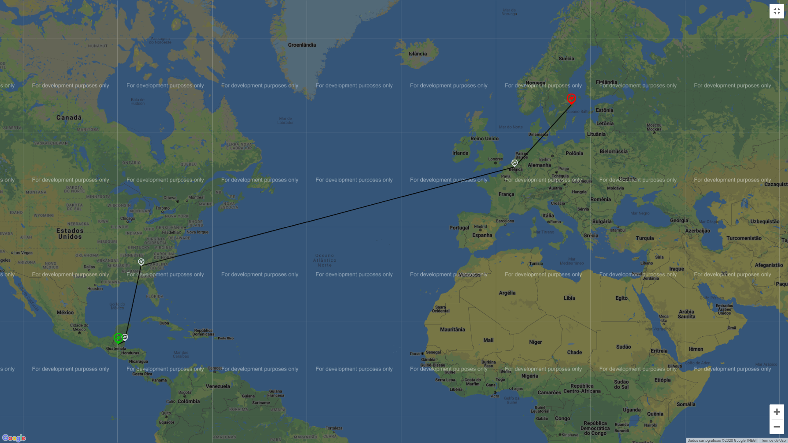
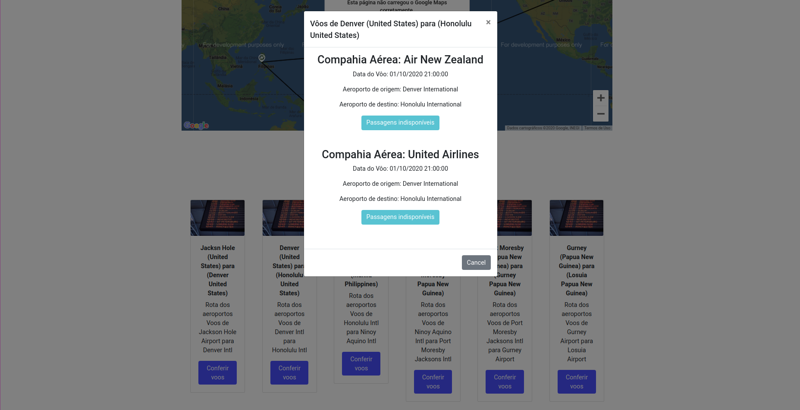

**Número da Lista**: 2 
**Conteúdo da Disciplina**: Dijkstra - Shortest path problem 

## Alunos
|Matrícula | Aluno |
| -- | -- |
| 17/0138551|Bruno Duarte|
| 17/0033112|Eugênio Sales|

## Sobre 
    Aplicação web que apresenta a melhor escala de aeroportos dados um de saída e chegada. Além disso, informa os voos disponíveis com o itinerário de aeroportos apresentado pelo menor caminho, baseado na distância entre os aeroportos obtida pela latitude e longitude como peso das arestas.

## Screenshots

## Depêndecnias

**Linguagem**: Javascript (Framework React.js)
 

## Execução

- É necessário instalação do [Npm](https://docs.npmjs.com/cli/install) e [Node](https://nodejs.org/en/download/)
- Clone o repositório `$ sudo apt get install virtualenv`
- Instale as depências `$ npm install`
- Inicie `$ npm start`

## Uso 
A utilização do projeto requer poucos passos visando facilitar a correção do projeto. Após instalar as duas depêndencias

> 1 - Escolha 2 aeroports diferentes no Drop Down

> 2 - Navegue pelo mapa para ver o caminho no google maps. O ícone verde é referente ao aeroporto de origem, os cinzas aos intermediários e o vermelho ao de destino. Esse caminho corresponde ao grafo resultante do Dijkstra. Ao clicar nos ícones, é possível verificar o nome do aeroporto.

> 3 - Abaixo seguem os cards com opções de vôos para cada um dos caminhos indicados pelo grafo. Cada Card é correspondente a um caminho entre 2 nós do grafo, ou seja, o trajeto de uma aeroporto ao outro dentro da escala.

> 4 - Ao conferir os vôos, é demonstrado uma lista de vôos para o loca selecionado incluindo informações como data e compahia aérea a partri de uma api em tempo real

## Outros 
O foco do projeto foi demonstrar a melhor escala aérea possível considerando-se latitude e longitude dos aeroportos como pesos das arestas. E uma, vez demonstradas as escalas os possǘeis vôoes em tempo real desse caminho sugerid.

## Restrições
 * O dataset utilizado para gerar as conexões englobam 3206 aeroportos. Dessa forma, ele não cobre todos os aeroportos do mundo, nesse sentido, os resultados funcionam bem para o trabalho em questão, mas talvez não reflita o melhor caminho em um cenário real dado as condições do volume de dados necessário para tal.
